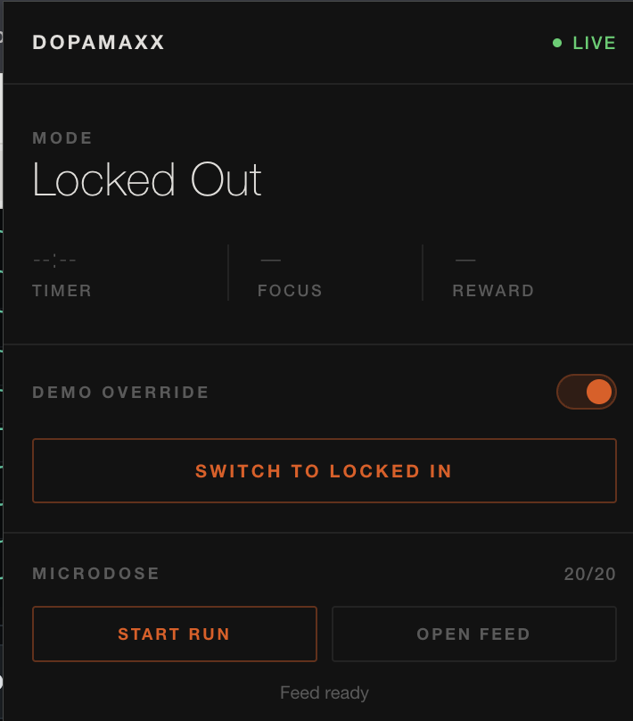
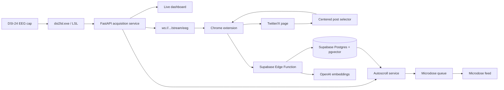

# DopaMAXX

**Work harder, play harder.**

DopaMAXX is an EEG-driven focus companion for people who want the reward loop of
social media without letting it own their work session. A DSI-24 EEG cap streams
live brain signals, DopaMAXX estimates focus and reward proxies, and the app uses
those signals to decide when to protect work and when to serve a short,
personalized content break.

Built as a hackathon project by zane, casper, ansh, and alex.



## The Idea

Most focus tools treat distraction as binary: block everything, then release the
block on a timer. DopaMAXX makes the loop adaptive:

| Mode | What the user does | What DopaMAXX learns |
| --- | --- | --- |
| Locked In | Work in a distraction-constrained session | Whether focus is stable or drifting |
| Locked Out | Freely scroll Twitter/X during an earned break | Which posts create a positive EEG reward response |
| Microdose | See 1 to 3 curated posts while drifting | Whether a tiny reward is enough to re-engage |

The key feedback loop:

1. During Locked Out, the Chrome extension watches the centered Twitter/X post.
2. After a dwell threshold, the post is captured as a timer-based demo signal.
3. Supabase/local storage keeps the post, timing context, and optional EEG data.
4. During Locked In, the autoscroll engine queues visible For You candidates
   without EEG reward or embedding matching.
5. If focus drops, the microdose feed serves a small, personalized burst and then
   hands the user back to work.

Important note: DopaMAXX does not claim to measure dopamine directly. In this
repo, "dopamine" means an explainable EEG-derived reward/engagement proxy.

## What Works Today

- Live DSI-24 acquisition service with simulator mode.
- Browser dashboard with raw EEG, derived focus/reward metrics, and demo status.
- Chrome MV3 extension for Locked In blocking, Locked Out capture, and demo
  controls.
- Twitter/X post selector that chooses the centered, stable post after dwell.
- Supabase Edge Function that stores posts, observations, and OpenAI embeddings.
- Supabase-backed autoscroll/microdose queue for Locked In recommendations.
- Offline fallback embeddings for demos and tests when external services are not
  available.
- Focused Python and Node test coverage for acquisition, selector behavior,
  contracts, scoring, and extension prompt data.

## Architecture



## Repo Map

| Path | Purpose |
| --- | --- |
| `acquisition/` | FastAPI service, DSI-24 bridge integration, simulator, EEG WebSockets, dashboard, autoscroll API |
| `extension/` | Chrome MV3 extension, popup UI, Locked In blocking, Locked Out capture scripts |
| `locked_out_capture/` | Supabase Edge Function, SQL migrations, EEG capture contract, selector tests |
| `supabase/migrations/` | Autoscroll and microdose queue schema |
| `tribev2_text/` | Standalone text-to-signature experiments and deterministic fake backend |
| `twitter_scorer/` | CLI experiments for ranking Twitter posts with TRIBE/EEG scores |
| `PRD.md` | Product requirements and deeper design rationale |

## Quickstart: Local Simulator Demo

Use this path when you do not have the DSI-24 cap connected.

```sh
python -m venv .venv
source .venv/bin/activate
python -m pip install -U pip
python -m pip install -e "./acquisition[dev]"
python -m pip install -e "./tribev2_text[dev]"
python -m pip install -e "./twitter_scorer[dev]"
python -m acquisition serve --simulate
```

Open:

```text
http://127.0.0.1:8000
```

Useful simulator endpoints:

| URL | Use |
| --- | --- |
| `http://127.0.0.1:8000/` | Live dashboard |
| `http://127.0.0.1:8000/health` | Runtime health |
| `http://127.0.0.1:8000/metadata` | Stream metadata |
| `ws://127.0.0.1:8000/stream/eeg` | Derived focus/reward frames |
| `ws://127.0.0.1:8000/stream/raw` | Binary raw sample stream |
| `http://127.0.0.1:8000/microdose/feed` | Microdose feed page |

## Real DSI-24 Setup

The DSI-24 vendor bridge is Windows-only, so the real acquisition host should be
a Windows laptop with the headset and `dsi2lsl.exe` available.

```powershell
cd C:\path\to\dopamaxx
python -m pip install -e .\acquisition[dev]
python -m acquisition serve `
  --port COM9 `
  --bridge-path "C:\path\to\dsi2lsl.exe" `
  --host 0.0.0.0 `
  --http-port 8765
```

Other machines on the same network can connect to the capture laptop:

```text
http://<capture-ip>:8765/
ws://<capture-ip>:8765/stream/eeg
ws://<capture-ip>:8765/stream/raw
```

Use `/stream/eeg` for focus/reward consumers. Use `/stream/raw` only for tools
that need raw samples.

## Supabase Setup

For the team demo project currently linked from this workspace:

```text
project ref: kbnbpangliwqthtjpgxm
project url: https://kbnbpangliwqthtjpgxm.supabase.co
```

If you fork this project, replace those values with your own Supabase project.

Apply the SQL migrations in this order:

1. `locked_out_capture/supabase/migrations/001_locked_out_capture.sql`
2. `locked_out_capture/supabase/migrations/002_add_focus_score_to_post_observations.sql`
3. `supabase/migrations/20260607000000_autoscroll.sql`

Deploy the capture Edge Function from the `locked_out_capture` package:

```sh
cd locked_out_capture
supabase link --project-ref <project-ref>
supabase functions deploy capture-post
supabase secrets set OPENAI_API_KEY=<openai-api-key>
supabase secrets set OPENAI_EMBEDDING_MODEL=text-embedding-3-small
```

Supabase provides `SUPABASE_URL` and secret keys to deployed functions. Do not
put the OpenAI key or Supabase service-role key in the Chrome extension.

## Environment Variables

Backend/acquisition service:

```sh
export DOPAMAXX_SUPABASE_URL="https://kbnbpangliwqthtjpgxm.supabase.co"
export DOPAMAXX_SUPABASE_SERVICE_ROLE_KEY="<backend-only-service-role-key>"

# Optional: use OpenAI embeddings from the acquisition service.
export DOPAMAXX_OPENAI_API_KEY="<openai-api-key>"
export OPENAI_EMBEDDING_MODEL="text-embedding-3-small"

# Optional: fetch live candidates through a Twitter/X MCP endpoint.
export DOPAMAXX_TWITTER_MCP_URL="http://127.0.0.1:9000/mcp"
export DOPAMAXX_TWITTER_MCP_FETCH_TOOL="twitter.search_candidates"
```

Windows PowerShell equivalent:

```powershell
$env:DOPAMAXX_SUPABASE_URL = "https://kbnbpangliwqthtjpgxm.supabase.co"
$env:DOPAMAXX_SUPABASE_SERVICE_ROLE_KEY = "<backend-only-service-role-key>"
$env:DOPAMAXX_OPENAI_API_KEY = "<openai-api-key>"
$env:OPENAI_EMBEDDING_MODEL = "text-embedding-3-small"
```

Secret-handling rule:

| Value | Where it is allowed |
| --- | --- |
| Supabase project URL | Backend, browser, docs |
| Supabase publishable/anon key | Browser extension and backend read paths |
| Supabase service-role key | Backend only |
| Supabase DB password | CLI/admin only |
| OpenAI API key | Supabase Edge Function or backend only |

## Chrome Extension Setup

1. Open `chrome://extensions`.
2. Enable Developer Mode.
3. Click "Load unpacked".
4. Select the repo's `extension/` directory.
5. Open the extension service worker console and configure Locked Out capture:

```js
chrome.storage.local.set({
  lockedOutCaptureConfig: {
    supabaseFunctionUrl: "https://kbnbpangliwqthtjpgxm.supabase.co/functions/v1/capture-post",
    supabaseAnonKey: "<supabase-publishable-or-anon-key>",
    userId: "demo_user",
    eegWsUrl: "ws://127.0.0.1:8000/stream/eeg"
  }
});
```

For a hardware demo, change `eegWsUrl` to the capture laptop:

```js
eegWsUrl: "ws://<capture-ip>:8765/stream/eeg"
```

The extension never stores the service-role key.

## Microdose Flow

Start the acquisition service, then create an autoscroll run:

```sh
curl -X POST http://127.0.0.1:8000/agent/autoscroll/start \
  -H "content-type: application/json" \
  -d '{
    "user_id": "demo_user",
    "session_id": "demo_session",
    "target_count": 20,
    "timeout_s": 10
  }'
```

Open the feed:

```text
http://127.0.0.1:8000/microdose/feed?user_id=demo_user&session_id=demo_session
```

Fetch queue JSON directly:

```text
http://127.0.0.1:8000/feed/microdose?user_id=demo_user&session_id=demo_session
```

In a fully connected demo, candidate posts come from either the extension's
buffered For You observations or a configured Twitter/X MCP source. If neither
is available, local tests and simulator demos still exercise the ranking logic
with deterministic fallback embeddings.

## Hackathon Demo Script

1. Start the acquisition server in simulator mode or from the DSI-24 capture
   laptop.
2. Open the dashboard and show live focus/reward movement.
3. Load the Chrome extension and switch between Locked In and Locked Out.
4. In Locked Out, scroll Twitter/X and dwell on a post long enough for capture.
5. Show the Supabase observation row and dwell/timer context.
6. Switch back to Locked In and start a microdose run.
7. Open the microdose feed and show timer-selected posts queued from the For You
   buffer.
8. Explain the safety boundary: raw EEG is not uploaded by the extension; stored
   observations contain derived timing, focus, reward, and post metadata.

## API Reference

| Method | Route | Purpose |
| --- | --- | --- |
| `GET` | `/` | Dashboard |
| `GET` | `/health` | Acquisition runtime health |
| `GET` | `/metadata` | Channel labels, sample rate, source mode |
| `POST` | `/sim/inject` | Inject simulator state |
| `WS` | `/stream/eeg` | Derived EEG frames with focus/reward inference |
| `WS` | `/stream/raw` | Binary raw EEG stream |
| `WS` | `/stream/raw-json` | Debug JSON raw EEG stream |
| `POST` | `/locked-out/reactions` | Store a post reaction directly through acquisition |
| `POST` | `/feed/for-you/candidates` | Buffer candidate posts from the extension |
| `POST` | `/agent/autoscroll/start` | Start a recommendation run |
| `POST` | `/agent/autoscroll/cancel` | Cancel a recommendation run |
| `GET` | `/agent/autoscroll/runs/{run_id}` | Inspect run status |
| `GET` | `/feed/microdose` | Read queued microdose items |
| `PATCH` | `/feed/microdose/{queue_id}` | Mark an item shown, dismissed, or consumed |

## Testing

Python tests:

```sh
python -m pytest acquisition/tests locked_out_capture/tests tribev2_text/tests twitter_scorer/tests
```

Node tests:

```sh
node locked_out_capture/tests/selector.test.cjs
node extension/tests/voice_prompts.test.cjs
```

Real TRIBE v2 integration is opt-in:

```sh
RUN_TRIBEV2_INTEGRATION=1 python -m pytest tribev2_text/tests/test_integration.py
```

## Privacy And Safety

- EEG is the only biosignal modality in scope.
- The extension sends derived context, not raw EEG samples.
- Raw EEG streaming is local-network oriented for the live demo.
- No clinical, diagnostic, or medical claims are made.
- Browser code must only receive publishable/anon Supabase keys.
- Service-role keys, DB passwords, and OpenAI keys stay on backend/admin
  surfaces.

## Troubleshooting

| Symptom | Check |
| --- | --- |
| Dashboard is blank | Confirm `python -m acquisition serve --simulate` is still running |
| No EEG frames in extension | Check `eegWsUrl`, same-network access, and Windows Firewall |
| Real headset will not stream | Close DSI-Streamer before starting DopaMAXX; the COM port cannot be shared |
| Capture says it is not configured | Re-run the `chrome.storage.local.set(...)` snippet in the service worker console |
| Supabase returns 401/403 | Use the publishable/anon key in Chrome and service-role key only on backend |
| Embeddings stay pending/failed | Check the Edge Function `OPENAI_API_KEY` secret |
| Microdose queue is empty | Seed Locked Out hits first or configure a Twitter/X MCP candidate source |

## Future Work

- Per-user calibration instead of fixed heuristic thresholds.
- Learned preference head on top of post embeddings.
- Stronger artifact rejection for motion, blinks, and disconnected electrodes.
- More controlled Twitter/X candidate retrieval.
- Multi-user auth and secure profile isolation.
- Better operator console for deterministic live judging demos.
