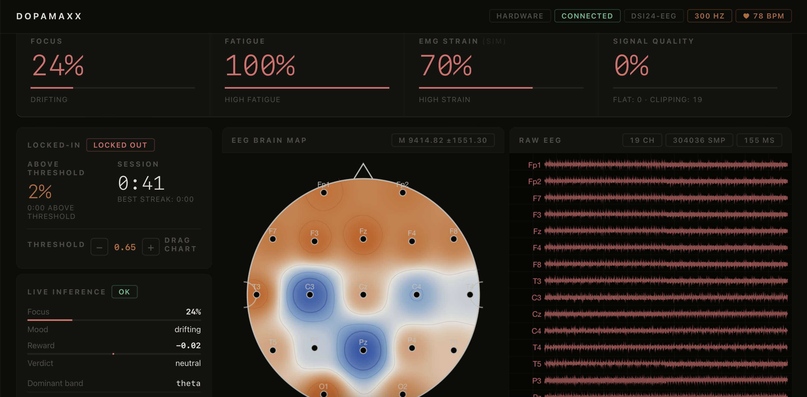
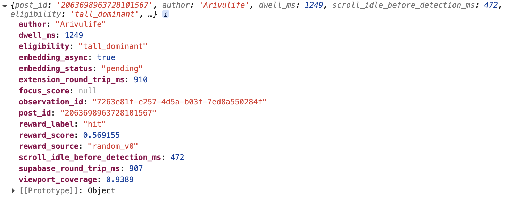
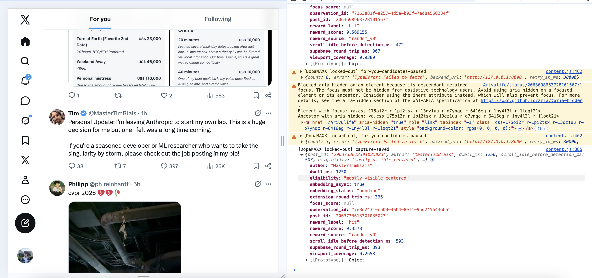
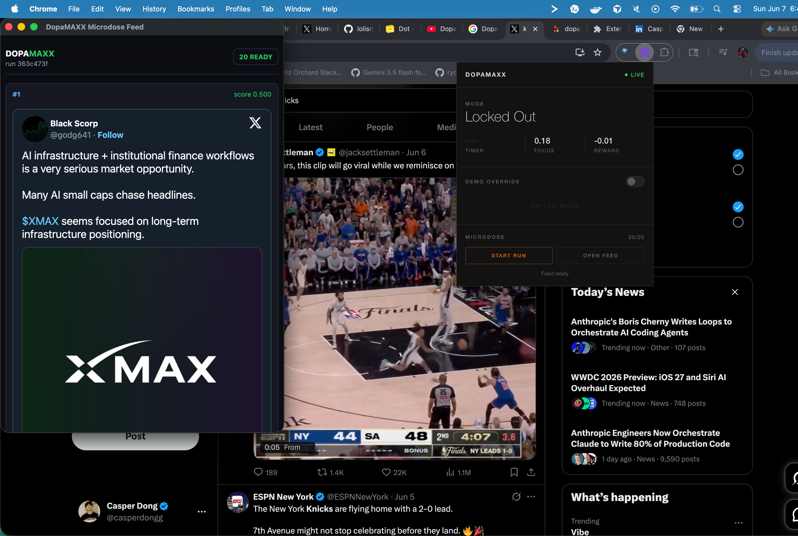
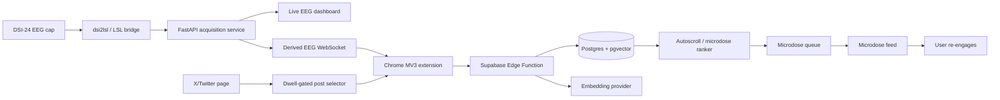

# DopaMAXX

**Work harder, play harder. Then let the EEG decide what "play" means.**

DopaMAXX is an EEG-driven experiment in personalized reward control: what if
your focus app could learn what kind of content your brain actually responds to,
serve it back with precision, and then get you back to work? A DSI-24 EEG cap
streams live brain signals, a Chrome extension watches what the user pauses on
in X/Twitter, and a Supabase-backed recommendation system learns which posts
produce positive focus/reward responses. When the user starts drifting during a
work session, DopaMAXX serves a tiny "microdose" of content predicted to spike
engagement, then sends them back to work.

Built for a hackathon by **zane, casper, ansh, and alex**.

## What It Does

DopaMAXX has two modes. In **Locked Out**, the user is allowed to scroll
X/Twitter. The extension detects the post they actually dwell on, pairs that
post with the user's live EEG-derived reward/focus state, and stores the result
as a labeled memory: hit, miss, or neutral. This is the intentionally unserious
hackathon part: the demo tries to learn what produces the biggest reward signal,
even when that means learning the user's favorite flavor of brain rot.

In **Locked In**, distracting sites are blocked while the EEG stream monitors
whether the user is still focused. If focus drops, DopaMAXX runs a
retrieval-and-ranking loop over candidate posts, selects content similar to prior
EEG-positive hits and dissimilar to misses, and shows only a short microdose
before returning the user to work.

The core idea is not "we solved social media." We definitely did not. The demo
is closer to: what if the doomscrolling machine had a brain-computer interface
and you could see, store, and redirect the reward signal? That is funny, a little
cursed, and technically useful.

Important scope note: DopaMAXX does **not** claim to measure dopamine directly.
In this project, "dopamine" means an explainable EEG-derived reward/engagement
proxy from the headset stream.

## The Serious Version

The hackathon version maximizes for content that appears to trigger reward. That
is fun for a demo because the objective is obvious and visible: find the posts
that light the user up. But the same system can be pointed at a much healthier
goal with very little architectural change.

Instead of ranking posts by predicted dopamine/reward, DopaMAXX could rank for
healthy content: posts that calm the user down, teach them something, improve
mood without causing a spiral, or help them re-engage with work. The capture
pipeline, embeddings, RAG memory, and candidate ranking stay the same. The only
thing that changes is the objective function.

In other words: today it is a meme-y dopamine maximizer. Tomorrow it could be a
personalized filter for content that is actually good for you.

## The Problem

Modern focus tools treat distraction as binary: block the site or unblock the
site. Social platforms do the opposite: they optimize the reward loop as hard as
possible, usually for time spent on platform. Neither side gives the user much
control over the signal itself.

We wanted to expose that loop. If a feed can learn what keeps you scrolling, can
you build a user-owned system that learns the same signal, stores it locally or
in your own backend, and lets you choose what to optimize for?

## The Solution

DopaMAXX combines a real EEG acquisition pipeline, a browser extension, and a
RAG-style recommendation engine into one closed feedback loop:

1. **Measure focus:** stream DSI-24 EEG data and derive live focus/reward scores.
2. **Learn taste:** capture X/Twitter posts the user dwells on during earned
   breaks and label them with EEG reward signals.
3. **Retrieve rewards:** embed posts, store them in Supabase/pgvector, and use
   prior EEG-positive hits as the user's personal retrieval memory.
4. **Microdose content:** when focus drifts, rank fresh candidates against that
   memory and show a small, capped set of posts.
5. **Return to work:** once focus recovers or the cap is reached, DopaMAXX closes
   the loop and puts the user back into Locked In mode.

For the hackathon, we use the most chaotic objective because it is easy to
understand: maximize the content that seems to trigger reward. For a real
product, the same loop can optimize for healthier targets by changing the labels
and ranking policy.

## Project Workflow

In a demo, the user puts on the DSI-24 EEG cap and starts a work session in the
Chrome extension. While they are Locked In, distracting sites are blocked and the
dashboard shows live brain-derived focus signals. During a break, the user enters
Locked Out mode and scrolls X/Twitter normally. DopaMAXX watches which posts stay
centered on screen long enough to matter, records the surrounding EEG response,
and learns which posts were rewarding. Later, if the user starts losing focus
while working, DopaMAXX retrieves a few posts that look similar to past
EEG-positive hits, shows them as a controlled microdose, and then redirects the
user back into the work session.

## Visual Demo

**1. Microdose feed over X/Twitter.** DopaMAXX has a ranked queue ready, the
extension is live, and the microdose window is showing the next reward candidate.



**2. Locked Out capture.** While the user scrolls X/Twitter, the extension
detects stable, centered posts and saves EEG-labeled observations.



**3. Captured observation payload.** A post becomes a structured memory with
dwell time, reward label, reward score, embedding status, and Supabase timing.



**4. Live EEG dashboard.** The acquisition service streams DSI-24 hardware data,
derived focus/reward inference, signal quality, and raw channel traces.



## Technical Summary

Technically, DopaMAXX is a retrieval-augmented recommendation system where the
retrieval corpus is built from the user's own EEG-labeled reactions. The DSI-24
stream is ingested through a FastAPI acquisition service, normalized into derived
focus and reward frames, and exposed over WebSockets. The Chrome MV3 extension
captures dwell-gated X/Twitter posts, sends post metadata plus derived EEG
context to a Supabase Edge Function, and stores observations in Postgres with
vector embeddings. The ranking algorithm scores candidate posts by similarity to
the user's hit set minus similarity to their miss set, so the recommendation
target is not generic engagement - it is the user's measured neural response.
The objective is also swappable: reward-maximizing labels can be replaced with
healthy-content labels, calmness labels, learning labels, or any other
user-defined outcome. TRIBE v2 can improve this RAG loop by replacing generic
text embeddings with brain-aligned content signatures, allowing retrieval to
match posts by predicted activation pattern rather than only by surface-level
semantic similarity.

## Architecture



| Layer | What it does | Repo path |
| --- | --- | --- |
| EEG acquisition | Starts the DSI-24 bridge, reads LSL, computes live focus/reward frames, serves dashboard and WebSockets | `acquisition/` |
| Browser extension | Blocks distractions, controls modes, captures centered X/Twitter posts, connects to EEG stream | `extension/` |
| Locked Out capture | Supabase Edge Function, SQL schema, capture contract, selector tests | `locked_out_capture/` |
| Recommendation memory | Stores posts, observations, labels, embeddings, and microdose queue state | `supabase/migrations/` |
| TRIBE experiments | Text-to-signature experiments and fake backend for future embedding upgrades | `tribev2_text/` |
| Ranking experiments | CLI tools for scoring and ranking Twitter candidates | `twitter_scorer/` |

## The RAG And Ranking Loop

DopaMAXX uses RAG, but the "documents" are not static docs. They are the user's
own content reactions.

- **Capture corpus:** every dwelled post becomes a record with text, author/time
  metadata, dwell timing, focus score, reward score, and a reward label.
- **Embedding layer:** each post is embedded and stored in Supabase with
  pgvector. The current implementation supports OpenAI embeddings and local
  deterministic fallbacks for demos/tests.
- **Hit/miss memory:** posts with positive EEG reward become the hit set; posts
  with negative reward become the miss set.
- **Candidate retrieval:** candidate posts from the extension buffer or a
  Twitter/X source are embedded and compared against the memory.
- **Ranking algorithm:** score candidates by weighted similarity to hits minus a
  penalty for similarity to misses.
- **Microdose policy:** serve only the top few posts, enforce caps, and exit when
  focus recovers or the microdose limit is reached.

The scoring shape is intentionally explainable:

```text
predicted_reward(candidate)
  = similarity(candidate, EEG-positive hits)
  - lambda * similarity(candidate, EEG-negative misses)
```

TRIBE v2 would make this more powerful by producing richer content signatures
that can represent topics, tone, media style, and predicted brain response. In
the current system, two posts are similar if their embeddings are semantically
close. With TRIBE v2, two posts could be similar because they belong to the same
personal "tribe" of content that historically produces the same neural reward
pattern for this user. That turns the retrieval layer from generic semantic
search into a personalized brain-aligned memory.

That same memory does not have to chase the strongest dopamine spike. If the
label changes from "reward hit" to "healthy hit," the exact same RAG loop becomes
a personalized filter for content that leaves the user better off. The project is
funny because the demo objective is brain-rot; it is useful because the machinery
is objective-agnostic.

## How We Built It

**The EEG acquisition service** is a Python FastAPI app that can run against a
real DSI-24 headset or a simulator. In real hardware mode, the Windows capture
machine launches the vendor `dsi2lsl` bridge, reads the `DSI24-EEG` LSL stream,
and exposes both raw and derived streams. The derived stream is what the rest of
the app consumes: focus score, reward score, signal quality, dominant band, and
metadata.

**The Chrome extension** is a Manifest V3 extension with no build step. It owns
the user-facing modes, blocks distracting sites in Locked In, and injects a
Locked Out content script into X/Twitter. The content script chooses the centered
post, waits for a dwell threshold, and sends only stable post candidates forward.

**The Supabase capture pipeline** receives post captures through an Edge
Function. It upserts post records, stores EEG-derived observation rows, generates
embeddings, and keeps browser-safe keys separate from backend-only service keys.
The extension never receives the service-role key, database password, or OpenAI
API key.

**The autoscroll/microdose engine** is exposed through the acquisition service.
It reads prior EEG-labeled memories from Supabase or an in-memory fallback,
scores fresh candidates, writes a queue of microdose items, and serves a small
feed that can be shown during a drift event.

**The demo dashboard** gives judges something concrete to watch: live EEG
status, stream metadata, focus/reward inference, mode changes, and microdose
results.

## What Works Today

- Live DSI-24 acquisition service with simulator mode.
- Browser dashboard for raw EEG status and derived focus/reward metrics.
- Chrome extension for Locked In blocking, Locked Out capture, and demo control.
- Dwell-gated X/Twitter selector for centered, stable posts.
- Supabase Edge Function for post capture, observation storage, and embeddings.
- Supabase-backed autoscroll/microdose queue.
- Local fallback embeddings and in-memory stores for demos without cloud setup.
- Focused Python and Node tests for acquisition, selectors, contracts, scoring,
  and extension prompt data.

## Challenges We Ran Into

- **Real-time EEG is noisy.** We needed simulator mode, quality metadata, and
  derived frames so the rest of the app did not depend on raw samples directly.
- **Browser extension contexts are fragile during live demos.** Reloading an
  unpacked extension can invalidate old content scripts, so the extension now
  guards against stale contexts and refreshes X/Twitter tabs after reload.
- **X/Twitter DOM selection is unstable.** The selector has to choose the
  centered visible post and wait for dwell, not just grab the first matching DOM
  node.
- **Secrets cannot live in the extension.** Supabase service-role keys and
  OpenAI keys have to stay in Edge Functions or backend services.
- **A recommender can become the distraction.** The microdose loop needs caps,
  queue state, and a return-to-work condition so it stays bounded.
- **The objective function matters.** Maximizing reward is funny and demoable,
  but the same system should eventually optimize for content the user endorses,
  not just content that spikes engagement.

## Accomplishments

- Built an end-to-end EEG-to-browser loop with real DSI-24 hardware support.
- Captured live X/Twitter dwell events and paired them with EEG-derived reward
  labels.
- Stored a personalized post memory in Supabase with embeddings and observation
  metadata.
- Implemented a RAG-style ranker that retrieves content from the user's own
  EEG-positive history.
- Connected the ranker to a microdose feed that can be triggered during focus
  drift.
- Kept the demo runnable without hardware or cloud services through simulator
  and fallback paths.

## What We Learned

Personalization gets much more interesting when the feedback signal is not just
a click. Dwell time, likes, and follows are indirect proxies for preference; EEG
lets us experiment with a more immediate signal of attention, reward, and
re-engagement. We also learned that the hard part is not one model call. It is
the system boundary between hardware streams, browser state, cloud storage,
security, and a demo that still works under hackathon pressure.

## What's Next

- Per-user EEG calibration instead of fixed heuristic thresholds.
- TRIBE v2 embeddings or signatures for brain-aligned retrieval.
- A healthier ranking mode that filters for useful, calming, educational, or
  mood-improving content instead of raw reward maximization.
- Multimodal post embeddings that include image/video content.
- A learned preference head trained on the user's EEG hit/miss history.
- Stronger artifact rejection for blinks, motion, and disconnected electrodes.
- Authenticated multi-user profiles and encrypted personal memories.
- Better operator console for live judging and deterministic demos.

## Built With

- **Wearable Sensing DSI-24** for 19-channel EEG acquisition.
- **FastAPI** for the acquisition service, dashboard routes, and WebSockets.
- **Chrome Manifest V3** for browser blocking, capture, and mode control.
- **Supabase** for Postgres, Edge Functions, and vector-backed memory.
- **OpenAI embeddings** for the current post embedding path.
- **TRIBE v2 concepts** for the next-generation content signature layer.
- **Python and Node.js** for acquisition, ranking, tests, and extension logic.

## Quickstart: Simulator Demo

Use this path when you do not have the DSI-24 cap connected.

```sh
python -m venv .venv
source .venv/bin/activate
python -m pip install -U pip
python -m pip install -e "./acquisition[dev]"
python -m pip install -e "./tribev2_text[dev]"
python -m pip install -e "./twitter_scorer[dev]"
python -m acquisition serve --simulate
```

Open:

```text
http://127.0.0.1:8000
```

Useful local routes:

| URL | Use |
| --- | --- |
| `http://127.0.0.1:8000/` | Live dashboard |
| `http://127.0.0.1:8000/health` | Runtime health |
| `http://127.0.0.1:8000/metadata` | Stream metadata |
| `ws://127.0.0.1:8000/stream/eeg` | Derived focus/reward frames |
| `ws://127.0.0.1:8000/stream/raw` | Binary raw sample stream |
| `http://127.0.0.1:8000/microdose/feed` | Microdose feed page |

## Real DSI-24 Setup

The DSI-24 vendor bridge is Windows-only, so the real acquisition host should be
a Windows laptop with the headset and `dsi2lsl.exe` available.

```powershell
cd C:\path\to\dopamaxx
python -m pip install -e .\acquisition[dev]
python -m acquisition serve `
  --port COM9 `
  --bridge-path "C:\path\to\dsi2lsl.exe" `
  --host 0.0.0.0 `
  --http-port 8765
```

Other machines on the same network can connect to the capture laptop:

```text
http://<capture-ip>:8765/
ws://<capture-ip>:8765/stream/eeg
ws://<capture-ip>:8765/stream/raw
```

Use `/stream/eeg` for focus/reward consumers. Use `/stream/raw` only for tools
that need raw samples.

## Supabase Setup

Create a Supabase project, then apply the SQL migrations in this order:

1. `locked_out_capture/supabase/migrations/001_locked_out_capture.sql`
2. `locked_out_capture/supabase/migrations/002_add_focus_score_to_post_observations.sql`
3. `supabase/migrations/20260607000000_autoscroll.sql`

Deploy the capture Edge Function from the `locked_out_capture` package:

```sh
cd locked_out_capture
supabase link --project-ref <project-ref>
supabase functions deploy capture-post
supabase secrets set OPENAI_API_KEY=<openai-api-key>
supabase secrets set OPENAI_EMBEDDING_MODEL=text-embedding-3-small
```

Supabase provides `SUPABASE_URL` and secret keys to deployed functions. Do not
put the OpenAI key, Supabase service-role key, or database password in the
Chrome extension.

## Environment Variables

Backend/acquisition service:

```sh
export DOPAMAXX_SUPABASE_URL="https://<project-ref>.supabase.co"
export DOPAMAXX_SUPABASE_SERVICE_ROLE_KEY="<backend-only-service-role-key>"

# Optional: use OpenAI embeddings from the acquisition service.
export DOPAMAXX_OPENAI_API_KEY="<openai-api-key>"
export OPENAI_EMBEDDING_MODEL="text-embedding-3-small"

# Optional: fetch live candidates through a Twitter/X MCP endpoint.
export DOPAMAXX_TWITTER_MCP_URL="http://127.0.0.1:9000/mcp"
export DOPAMAXX_TWITTER_MCP_FETCH_TOOL="twitter.search_candidates"
```

Secret-handling rule:

| Value | Where it is allowed |
| --- | --- |
| Supabase project URL | Backend, browser, docs |
| Supabase publishable/anon key | Browser extension and backend read paths |
| Supabase service-role key | Backend only |
| Supabase DB password | CLI/admin only |
| OpenAI API key | Supabase Edge Function or backend only |

## Chrome Extension Setup

1. Open `chrome://extensions`.
2. Enable Developer Mode.
3. Click "Load unpacked".
4. Select the repo's `extension/` directory.
5. Open the extension service worker console and configure Locked Out capture:

```js
chrome.storage.local.set({
  lockedOutCaptureConfig: {
    supabaseFunctionUrl: "https://<project-ref>.supabase.co/functions/v1/capture-post",
    supabaseAnonKey: "<supabase-publishable-or-anon-key>",
    userId: "demo_user",
    eegWsUrl: "ws://127.0.0.1:8000/stream/eeg"
  }
});
```

For a hardware demo, change `eegWsUrl` to the capture laptop:

```js
eegWsUrl: "ws://<capture-ip>:8765/stream/eeg"
```

## Microdose Flow

Start the acquisition service, then create an autoscroll run:

```sh
curl -X POST http://127.0.0.1:8000/agent/autoscroll/start \
  -H "content-type: application/json" \
  -d '{
    "user_id": "demo-user",
    "session_id": "demo-session",
    "target_count": 20,
    "timeout_s": 10
  }'
```

Open the human-facing feed:

```text
http://127.0.0.1:8000/microdose/feed?user_id=demo-user&session_id=demo-session
```

Fetch queue JSON directly:

```text
http://127.0.0.1:8000/feed/microdose?user_id=demo-user&session_id=demo-session
```

In a fully connected demo, candidate posts come from either the extension's
buffered For You observations or a configured Twitter/X MCP source. If neither
is available, local tests and simulator demos still exercise the ranking logic
with deterministic fallback embeddings.


## API Reference

| Method | Route | Purpose |
| --- | --- | --- |
| `GET` | `/` | Live dashboard |
| `GET` | `/health` | Acquisition runtime health |
| `GET` | `/metadata` | Channel labels, sample rate, and source mode |
| `POST` | `/sim/inject` | Inject simulator focus/reward state |
| `WS` | `/stream/eeg` | Derived EEG frames with focus/reward inference |
| `WS` | `/stream/raw` | Binary raw EEG stream |
| `WS` | `/stream/raw-json` | Debug JSON raw EEG stream |
| `POST` | `/locked-out/reactions` | Store a post reaction directly through acquisition |
| `POST` | `/feed/for-you/candidates` | Buffer candidate posts from the extension |
| `POST` | `/agent/autoscroll/start` | Start a recommendation run |
| `POST` | `/agent/autoscroll/cancel` | Cancel a recommendation run |
| `GET` | `/agent/autoscroll/runs/{run_id}` | Inspect run status |
| `GET` | `/microdose/feed` | Human-facing microdose feed |
| `GET` | `/feed/microdose` | Read queued microdose items as JSON |
| `PATCH` | `/feed/microdose/{queue_id}` | Mark an item shown, dismissed, or consumed |

## Testing

Python tests:

```sh
python -m pytest acquisition/tests locked_out_capture/tests tribev2_text/tests twitter_scorer/tests
```

Node tests:

```sh
node locked_out_capture/tests/selector.test.cjs
node extension/tests/voice_prompts.test.cjs
```

Real TRIBE v2 integration is opt-in:

```sh
RUN_TRIBEV2_INTEGRATION=1 python -m pytest tribev2_text/tests/test_integration.py
```

## Privacy And Safety

- EEG is the only biosignal modality in scope.
- The extension sends derived context, not raw EEG samples.
- Raw EEG streaming is local-network oriented for the live demo.
- No clinical, diagnostic, or medical claims are made.
- Browser code must only receive publishable/anon Supabase keys.
- Service-role keys, DB passwords, and OpenAI keys stay on backend/admin
  surfaces.

## Troubleshooting

| Symptom | Check |
| --- | --- |
| Dashboard is blank | Confirm `python -m acquisition serve --simulate` is still running |
| No EEG frames in extension | Check `eegWsUrl`, same-network access, and Windows Firewall |
| Real headset will not stream | Close DSI-Streamer before starting DopaMAXX; the COM port cannot be shared |
| Capture says it is not configured | Re-run the `chrome.storage.local.set(...)` snippet in the service worker console |
| Supabase returns 401/403 | Use the publishable/anon key in Chrome and service-role key only on backend |
| Embeddings stay pending or failed | Check the Edge Function `OPENAI_API_KEY` secret |
| Microdose queue is empty | Seed Locked Out hits first or configure a Twitter/X MCP candidate source |

## TRIBE v2 Upgrade Path

Today, DopaMAXX can rank posts with normal text embeddings: embed the post,
compare it to EEG-labeled hits and misses, then microdose the closest hits. The
more accurate version replaces that text embedding layer with **TRIBE v2
signatures**. Instead of asking "are these posts semantically similar?", each
post is converted into a predicted neural activation signature, and candidates
are compared in that brain-aligned space.

EEG still supplies the live reward labels. When a user dwells on a post and the
EEG reward proxy marks it as a hit, DopaMAXX stores the post's TRIBE v2
signature in the user's hit set. Future candidates are then ranked by similarity
to high-reward TRIBE signatures and distance from miss signatures. This should be
better than generic embeddings because two posts may use different words while
still producing similar neural responses.

The fMRI/EEG connection is the reason this is plausible. fMRI gives high-spatial
resolution, slower measurements of brain activity; EEG gives lower-spatial
resolution, fast real-time measurements. They are not the same signal, but they
are different views of the same underlying neural dynamics. Practically, that
means both can be treated as high-dimensional response spaces with shared latent
structure: TRIBE v2 provides a dense fMRI-style content representation, while
DopaMAXX uses EEG as the online feedback signal that says which regions of that
representation are rewarding for this specific user.
